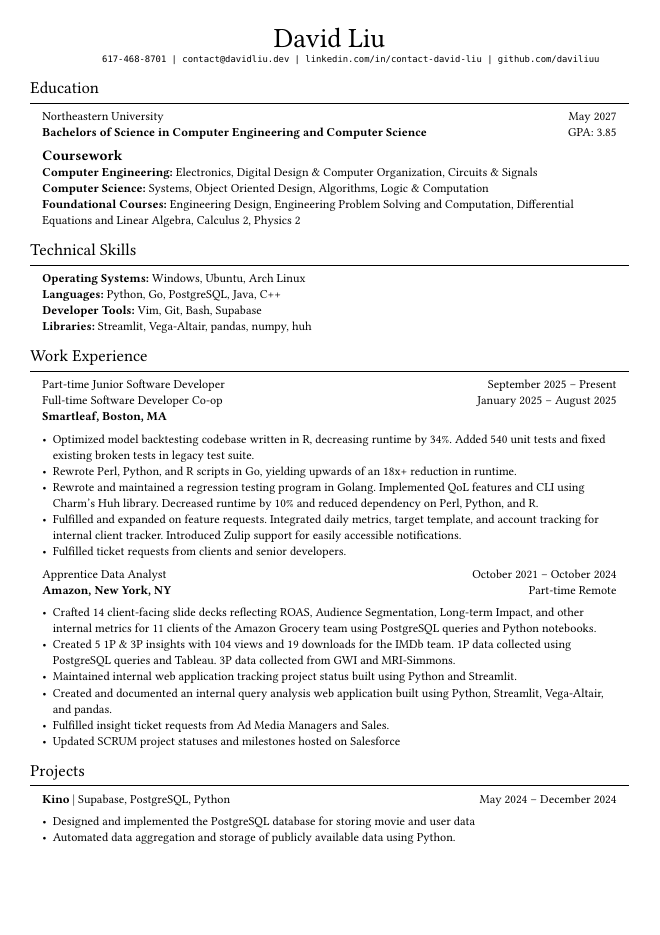

# Resume

## Overview

This repo is a mini-project that builds your resume using typst, a typesetting
language similar to LaTeX. The output is similar to Jake's resume, all without
needing to mess with LaTeX!

## Instructions

1. Copy over the project via.

```
git clone https://github.com/daviliuu/ResumeBuilder.git
```

2. Download typst and rye for your operating system:

#### Windows

```
winget install --id Typst.Typst
winget install --id=Rye.Rye  -e
```

#### Mac 
```
brew install typst rye
```

#### Ubuntu
```
sudo apt install typst rye
```

#### Arch
```
yay -S typst rye
```

3. Modify the config.json file to fit your profile! The parser is relatively
modular, so long as your keys are the same as the ones in the template. You
can add or remove experiences, skills, or projects! There is an arbitrary limit 
of 1 education section, though, and will be patched out later.

4. Run the project via rye
```
rye run resume
```

5. Compile the typst code into a pdf file
```
typst compile resume.typ
```

## Results

Your results should look similar to mine, attached below:


