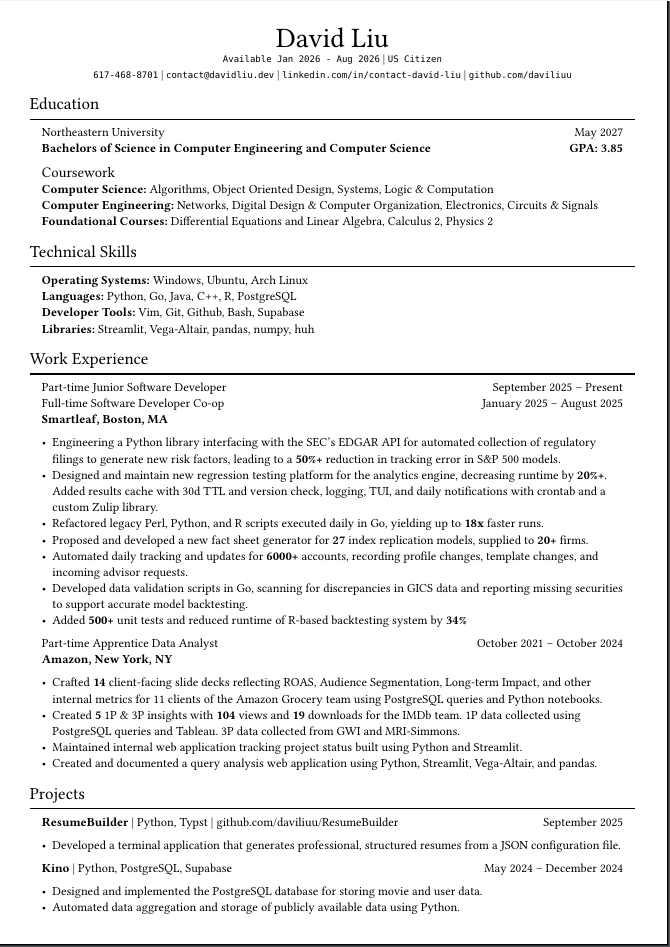

# Resume

## Overview

This repo is a mini-project that builds your resume using typst, a typesetting
language similar to LaTeX. The output is similar to Jake's resume, all without
needing to mess with LaTeX!

## Instructions

1. Copy over the project via.

```
git clone https://github.com/daviliuu/ResumeBuilder.git
```

2. Download typst and rye for your operating system:

#### Windows

```
winget install --id Typst.Typst
winget install --id=Rye.Rye  -e
```

#### Mac 
```
brew install typst rye
```

#### Ubuntu
```
sudo apt install typst rye
```

#### Arch
```
yay -S typst rye
```

3. Modify the config.json file to fit your profile! You can add or remove the 
education, experiences, skills, or projects sections! It's fairly modular, 
with required sections marked as "Required" if you choose to include the 
section in your resume. i.e. the name of the school, graduation date, and 
degree program are required fields if you choose to include an *Education* 
section on your resume.

4. Run the project via rye
```
rye run resume
```

5. Compile the typst code into a pdf file
```
typst compile resume.typ
```

## Results

Your results should look similar to mine, attached below:


